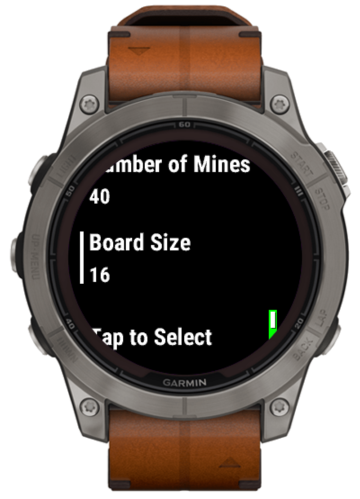

# Mines

A Minesweeper clone for Garmin watches. Adjustable number of mines and board size. The game requires a touch screen.

## Usage

Tap on a cell to select it (can be disabled).

Swipe in any direction on the screen to move the cursor and adjust the selection.

Press the physical physical 'Start' button to open the selected cell (right upper button on most watches).

Long press anywhere on the screen to place/remove a flag on the currect cursor position (can be disbaled). It does not matter where you press as the flag will be always placed/removed at the current cursor position.

Alternatively: Press the physical 'Down' button to place/remove a flag (button not available on all watches).

After a round is finished press the physical button 'Start' to start a new game.

The game will be automatically saved when closing and loaded when reopening the app. You can also start a new game in the settings. 

## Settings

To open the settings press and hold the 'Menu' button (Fenix/Epix/Forerunner etc.: left middle button, Venu/vivoactive: right lower (upper on Venu 2 Sq) botton).

In the settings you can 
    - start a new game
    - adjust the board size (2x2 to 16x16).
    - set the number of mines on the board (0 - 50).
    - enable/disable some of the touch controls.

Unfortunately, Venu 2 and Vivoactive 5 do not have scalable fonts. For larger board sizes the font size and quality are therefore not optimal on these watches.

Please report any bugs and send me suggestions for improvements.

## Installation

The game is available on the ConnectIQ store: https://apps.garmin.com/apps/15747050-c97a-4eef-bcc0-6b3950ccd2fe

A precompiled .iq file can be found in the 'builds' folder.